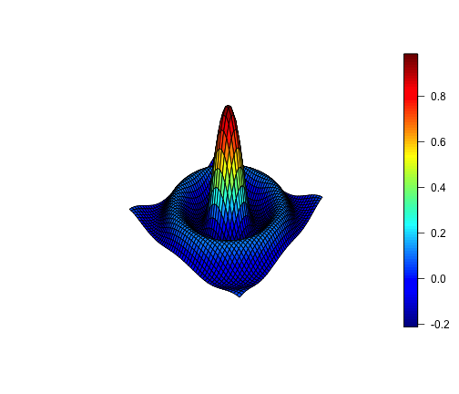

## Other interesting aspects of the first Shiny idea

- On the _sidebar_, there are three `selectInput` widgets. Two of them are __context dependent__: selection lookups should  include all the dataset variables except of the alredy selected variables (indeed, you cannot build a formula `z ~ x + y` where one variable is used more than once).
- In that case, in server.R you should make a list of valid variables and render `selectInput` element.

```r
# server.R (extract from the code)
varNames <- names(mtcars)

# Reactive code to update lookups for X and Y variables which must be different from Z and each other.
xList <- reactive({ varNames[!varNames==input$z] })
yList <- reactive({ varNames[!varNames==input$z & !varNames==input$x] })

# Create dynamic input elements with updated lookups. Also define the lookup default values.
output$selectZ <- renderUI({selectInput("z", label = "Select Z", choices = varNames, selected = "mpg")})
output$selectX <- renderUI({selectInput("x", label = "Select X", choices = xList(), selected = "cyl")})
output$selectY <- renderUI({selectInput("y", label = "Select Y", choices = yList(), selected = "disp")})
```
- In ui.R, you should include the rendered html code.

```r
# ui.R (extract from the code)
sidebarPanel(
    htmlOutput("selectZ"),
    htmlOutput("selectX"),
    htmlOutput("selectY"),
    <...>
)
```

--- &twocol

## Just for fun - plot Sombrero function

$$f(x,y)=\frac{sin(\sqrt{x^2+y^2})}{\sqrt{x^2+y^2}}$$

*** {name: left}
__R code__


```r
library(plot3D)
# Create X*Y grid
X <- seq(-10, 10, length.out = 50)
Y <- seq(-10, 10, length.out = 50)
M <- mesh(X, Y)

# Create variables and function as matrcies
x <- M$x
y <- M$y
z <- sin(sqrt(x^2+y^2))/sqrt(x^2+y^2)

# Plot
surf3D(x, y, z, border = "black")
```

*** {name: right}
__Plot__

 

--- &radio

## Just for fun - quiz

How do the slide 2 and 4 show text and image/plot side by side (text on the left side, and image on the right)?

1. By magic
2. _This slide has a two column layout_
3. This slide has a table layout
3. I do not know

*** .hint
This is definitely not a table.

*** .explanation
Read _Customizing Layouts_ in the [Slidify Customization Tutorial](http://slidify.org/customize.html).


